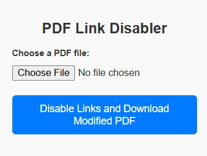

# Chrome Extension: Disable Internal Links in PDFs

This Chrome extension allows users to disable internal links in PDFs. This makes it easier to copy text without accidental navigation. The extension includes a **file selection** feature, and users can download a new PDF with the internal links disabled.

## Features

- **Disable Internal Links:** Automatically removes internal links referencing other pages in the same PDF.
- **File Selection:** Easily select your desired PDF file through the extension.
- **Download Modified PDF:** Save the updated PDF with internal links disabled.
- **Enhanced User Experience:** Simplifies text copying without distractions.

## How to Use

1. **Install the Extension:** Add the extension to your Chrome browser.
2. **Open the Extension:** Click on the extension icon in your browser.
3. **Select PDF:** Use the "Choose File" button to upload your PDF.
4. **Process File:** The extension processes the PDF to disable internal links.
5. **Download Updated PDF:** Click on the "Disable Links and Download Modified PDF" button to save the modified PDF.

## Screenshot

## Installation Guide

1. Clone or download the extension code from the Github Repo.
2. Open Chrome and navigate to `chrome://extensions/`.
3. Enable "Developer mode" in the top-right corner.
4. Click on "Load unpacked" and select the extension folder.
5. The extension will now appear in your Chrome browser.

## Contact

For any queries or suggestions, feel free to reach out:
- **Email**: [ydvchetan01@gmail.com](mailto:ydvchetan01@gmail.com)
- **GitHub**: [Chetan0724](https://github.com/Chetan0724)

---

I hope this extension simplifies your workflow and enhances your PDF management experience!